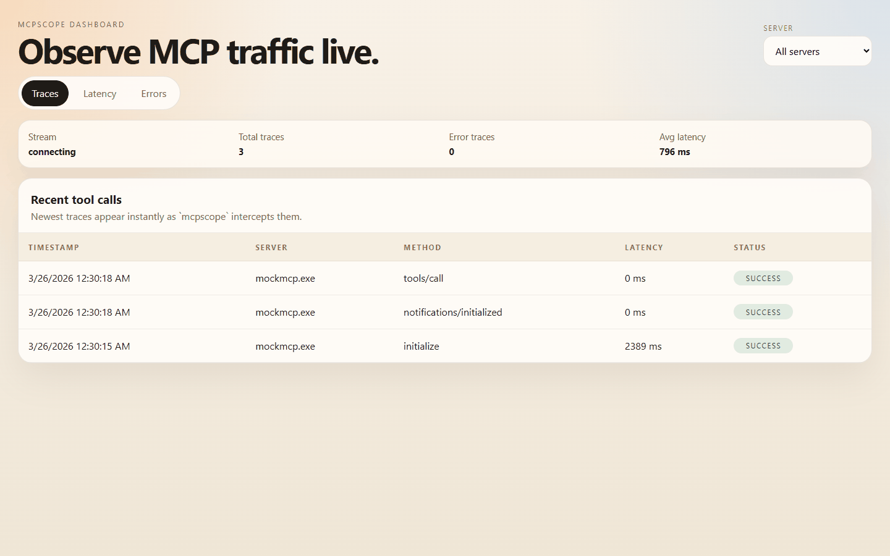

# mcpscope

Open source MCP observability: proxy traffic, inspect traces, replay calls, diff schemas, and alert on failures.



## What it does

- Proxies stdio and HTTP MCP traffic
- Captures request/response traces with latency and error state
- Serves a local dashboard for traces, latency, errors, and alerts
- Stores traces in SQLite with retention controls
- Supports workspace and environment scoping
- Evaluates built-in alert rules and delivers to webhook, Slack, or PagerDuty
- Exports traces for replay and CI checks
- Snapshots and diffs MCP schemas

## Quick start

```bash
go install github.com/td-02/mcpscope@latest
```

```bash
mcpscope proxy --server ./your-mcp-server --db traces.db
```

Open `http://localhost:4444`.

For commands with arguments:

```bash
mcpscope proxy -- uv run server.py
```

For an existing HTTP MCP server:

```bash
mcpscope proxy --transport http --upstream-url http://127.0.0.1:8080
```

## Common flows

Run with config:

```bash
mcpscope proxy --config ./mcpscope.example.json -- uv run server.py
```

Export traces:

```bash
mcpscope export --config ./mcpscope.example.json --output traces.json --limit 200
```

Replay traces:

```bash
mcpscope replay --input traces.json -- uv run server.py
```

Fail CI on replay errors or latency regressions:

```bash
mcpscope replay --input traces.json --fail-on-error --max-latency-ms 500 -- uv run server.py
```

Check schema compatibility:

```bash
mcpscope snapshot --server ./your-mcp-server --output baseline.json
mcpscope diff baseline.json current.json --exit-code
```

## Config

Example config: [`mcpscope.example.json`](mcpscope.example.json)

Key fields:

- `version`: current config schema version, `1`
- `workspace`: logical project boundary
- `environment`: logical environment like `prod` or `staging`
- `authToken`: bearer token for dashboard API access
- `notification.webhookUrls`: generic webhooks
- `notification.slackWebhookUrls`: Slack incoming webhooks
- `notification.pagerDutyRoutingKeys`: PagerDuty routing keys
- `proxy.db`: SQLite path
- `proxy.transport`: `stdio` or `http`
- `proxy.retainFor`: trace retention duration
- `proxy.maxTraces`: trace cap

CLI flags override config values.

## Verified

Verified in this repo with:

- `go test ./cmd ./internal/...`
- `npm exec tsc -b` in [`dashboard/`](dashboard/)
- fresh `mcpscope.exe` build
- regenerated demo GIF from the current binary and dashboard

## Notes

- The dashboard served by the Go binary comes from [`dashboard/dist`](dashboard/dist).
- Rebuilding the Vite dashboard bundle currently needs Node `20.19+` or `22.12+`.

## License

MIT
